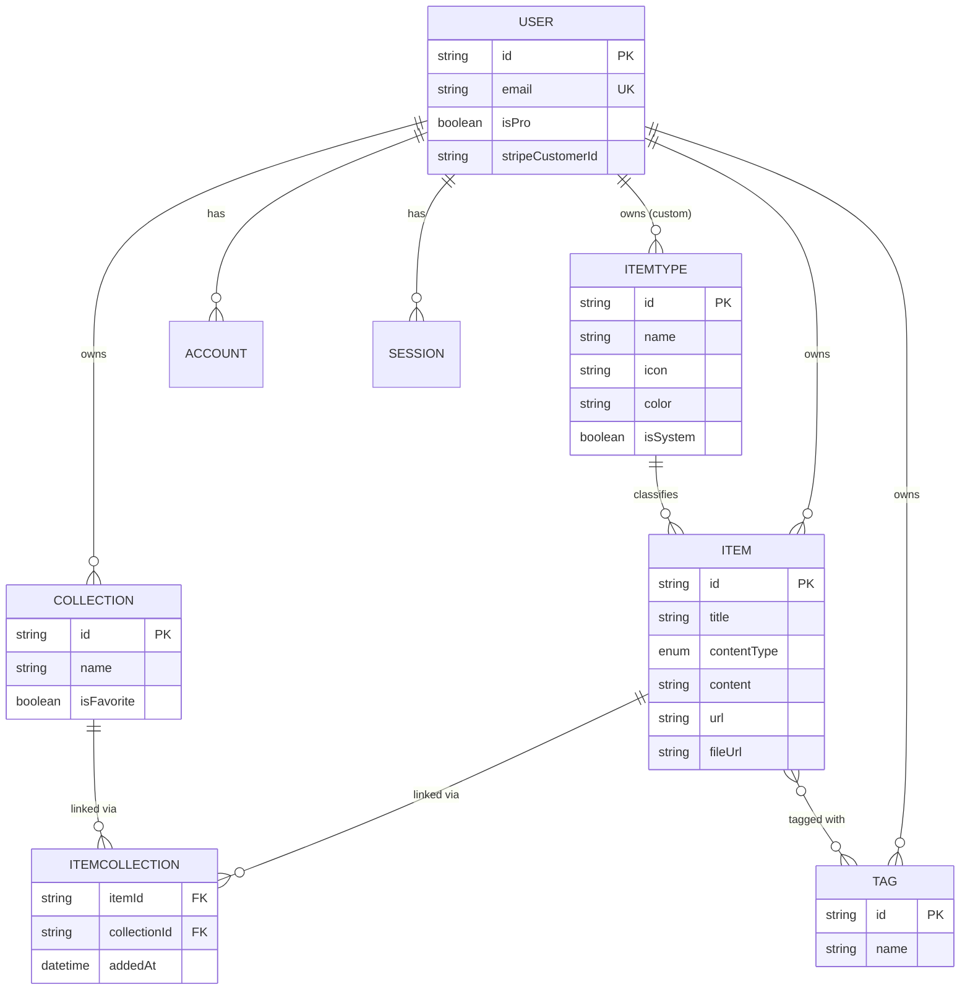
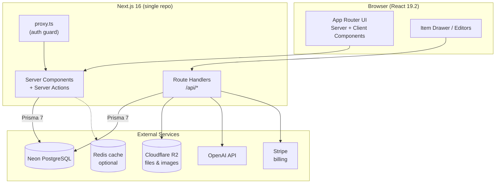

# DevStash — Project Overview

> One fast, searchable, AI-enhanced hub for everything a developer stashes: snippets, prompts, commands, notes, links,
> and files.

**Status:** Planning / pre-development
**Stack at a glance:** Next.js 16 · React 19.2 · TypeScript · Prisma 7 · PostgreSQL (Neon) · Auth.js v5 · Tailwind CSS
v4 · shadcn/ui · Cloudflare R2 · OpenAI · Stripe

---

## Table of Contents

1. [The Problem](#1-the-problem)
2. [Target Users](#2-target-users)
3. [Feature Set](#3-feature-set)
4. [Data Model](#4-data-model)
5. [Application Architecture](#5-application-architecture)
6. [Routing & API Surface](#6-routing--api-surface)
7. [Tech Stack](#7-tech-stack)
8. [Monetization](#8-monetization)
9. [UI / UX](#9-ui--ux)
10. [Type Colors & Icons](#10-type-colors--icons)
11. [Suggested Build Roadmap](#11-suggested-build-roadmap)
12. [Open Questions & Decisions](#12-open-questions--decisions)
13. [Notes on Changes I Made](#13-notes-on-changes-i-made)

---

## 1. The Problem

Developers keep their essentials scattered across too many tools:

- Code snippets in VS Code or Notion
- AI prompts buried in chat histories
- Context files hidden inside projects
- Useful links lost in bookmarks
- Docs in random folders
- Commands in `.txt` files
- Project templates in GitHub gists
- Terminal commands in bash history

The result is constant context switching, lost knowledge, and inconsistent workflows. **DevStash** consolidates all of
it into a single, fast, searchable, AI-enhanced hub.

---

## 2. Target Users

| Persona                        | Core need                                                  |
|--------------------------------|------------------------------------------------------------|
| **Everyday Developer**         | A fast way to grab snippets, prompts, commands, and links. |
| **AI-first Developer**         | Saves prompts, contexts, workflows, and system messages.   |
| **Content Creator / Educator** | Stores code blocks, explanations, and course notes.        |
| **Full-stack Builder**         | Collects patterns, boilerplates, and API examples.         |

---

## 3. Feature Set

### A. Items & Item Types

Every stashed thing is an **Item** with a **type**. Users can eventually create custom types, but the app ships with
these **system types** (immutable):

| Type      | Content kind | Tier    |
|-----------|--------------|---------|
| `snippet` | text         | Free    |
| `prompt`  | text         | Free    |
| `note`    | text         | Free    |
| `command` | text         | Free    |
| `link`    | url          | Free    |
| `file`    | file         | **Pro** |
| `image`   | file         | **Pro** |

A type resolves to one of three **content kinds**: `TEXT` (snippet, prompt, note, command), `URL` (link), or `FILE` (
file, image). Type-scoped item lists live under clean URLs, e.g. `/items/snippets`, `/items/commands`.

Items should be quick to create and open via a **drawer** rather than a full page navigation.

### B. Collections

Users create **Collections** that can hold items of **any** type. An item can belong to **multiple** collections at
once (e.g. a React snippet in both *React Patterns* and *Interview Prep*).

Examples: *React Patterns* (snippets, notes), *Context Files* (files), *Python Snippets* (snippets).

### C. Search

Powerful search across **content**, **tags**, **titles**, and **types**.

### D. Authentication

Email/password **or** GitHub OAuth sign-in.

### E. General Features

- Favorite collections and items
- Pin items to the top
- "Recently used" view
- Import code from a file
- Markdown editor for text types
- File upload for file/image types
- Export data in multiple formats
- Dark mode (default for devs), light mode optional
- Add/remove items to/from multiple collections
- See which collections an item belongs to

### F. AI Features *(Pro only)*

- AI auto-tag suggestions
- AI summaries
- "Explain this code"
- Prompt optimizer

---

## 4. Data Model

> This is a working model, not final. It reflects the source notes plus a few corrections (
> see [§13](#13-notes-on-changes-i-made)).

### Entity-relationship diagram



### Prisma schema

Prisma 7 changed a few defaults: the client generator is now `prisma-client` (not `prisma-client-js`), it requires an
explicit `output` path, the connection URL moves to `prisma.config.ts`, and a driver adapter is required. The schema
below reflects that.

```prisma
// prisma/schema.prisma

generator client {
  provider = "prisma-client" // Prisma 7 default (was "prisma-client-js")
  output   = "../src/generated/prisma" // now required in v7
}

datasource db {
  provider = "postgresql"
  // Connection URL lives in prisma.config.ts in Prisma 7+
}

// ---------- Auth (NextAuth v5 / Auth.js) ----------

model User {
  id            String    @id @default(cuid())
  name          String?   
  email         String    @unique
  emailVerified DateTime? 
  image         String?   
  passwordHash  String?   // null for OAuth-only accounts

  // Billing / plan
  isPro                Boolean @default(false)
  stripeCustomerId     String? @unique
  stripeSubscriptionId String? @unique

  accounts    Account[]
  sessions    Session[]
  items       Item[]
  collections Collection[]
  tags        Tag[]
  itemTypes   ItemType[] // custom (non-system) types only

  createdAt DateTime @default(now())
  updatedAt DateTime @updatedAt
}

model Account {
  id                String  @id @default(cuid())
  userId            String  
  type              String  
  provider          String  
  providerAccountId String  
  refresh_token     String? 
  access_token      String? 
  expires_at        Int?    
  token_type        String? 
  scope             String? 
  id_token          String? 
  session_state     String? 

  user User @relation(fields: [userId], references: [id], onDelete: Cascade)

  @@unique([provider, providerAccountId])
  @@index([userId])
}

model Session {
  id           String   @id @default(cuid())
  sessionToken String   @unique
  userId       String   
  expires      DateTime 
  user         User     @relation(fields: [userId], references: [id], onDelete: Cascade)

  @@index([userId])
}

model VerificationToken {
  identifier String
  token      String
  expires    DateTime

  @@unique([identifier, token])
}

// ---------- Core domain ----------

enum ContentType {
  TEXT
  URL
  FILE
}

model ItemType {
  id       String  @id @default(cuid())
  name     String  
  icon     String  // lucide-react icon name, e.g. "Code"
  color    String  // hex, e.g. "#3b82f6"
  isSystem Boolean @default(false)

  userId String? // null for system types
  user   User?   @relation(fields: [userId], references: [id], onDelete: Cascade)

  items Item[]

  @@unique([userId, name]) // a user can't have two types of the same name
  @@index([userId])
}

model Item {
  id          String      @id @default(cuid())
  title       String      
  contentType ContentType @default(TEXT)

  content     String? // text/markdown body (null for file items)
  url         String? // for link/url types
  fileUrl     String? // Cloudflare R2 object URL (null for text)
  fileName    String? // original filename
  fileSize    Int? // bytes
  language    String? // optional syntax-highlight hint, e.g. "tsx"
  description String?

  isFavorite Boolean   @default(false)
  isPinned   Boolean   @default(false)
  lastUsedAt DateTime? // powers "Recently used"

  userId     String   
  user       User     @relation(fields: [userId], references: [id], onDelete: Cascade)
  itemTypeId String   
  itemType   ItemType @relation(fields: [itemTypeId], references: [id])

  collections ItemCollection[] 
  tags        Tag[]            @relation("ItemTags")

  createdAt DateTime @default(now())
  updatedAt DateTime @updatedAt

  @@index([userId])
  @@index([itemTypeId])
  @@index([userId, isPinned])
}

model Collection {
  id            String  @id @default(cuid())
  name          String  
  description   String? 
  isFavorite    Boolean @default(false)
  defaultTypeId String? // seed type for a still-empty collection (soft ref to ItemType.id)

  userId String 
  user   User   @relation(fields: [userId], references: [id], onDelete: Cascade)

  items ItemCollection[]

  createdAt DateTime @default(now())
  updatedAt DateTime @updatedAt

  @@index([userId])
}

model ItemCollection {
  itemId       String   
  collectionId String   
  addedAt      DateTime @default(now())

  item       Item       @relation(fields: [itemId], references: [id], onDelete: Cascade)
  collection Collection @relation(fields: [collectionId], references: [id], onDelete: Cascade)

  @@id([itemId, collectionId])
  @@index([collectionId])
}

model Tag {
  id   String @id @default(cuid())
  name String 

  userId String 
  user   User   @relation(fields: [userId], references: [id], onDelete: Cascade)

  items Item[] @relation("ItemTags")

  @@unique([userId, name])
  @@index([userId])
}
```

**Notes**

- **Freemium limits (50 items / 3 collections on Free)** are enforced in application logic, not the schema, so they can
  be lifted for a user the moment `isPro` flips.
- The `Item ↔ Tag` relation uses Prisma's implicit many-to-many (Prisma manages the `_ItemTags` join table) since tags
  carry no extra metadata. `Item ↔ Collection` is an **explicit** join table because it stores `addedAt`.
- System item types are rows with `userId = null` and `isSystem = true`, seeded once via a migration seed script.
- **Migrations only** — never `prisma db push`. Generate migrations, run them in dev, then in prod.

---

## 5. Application Architecture



- **One codebase / one repo** for less overhead.
- SSR pages with dynamic (client) components where interactivity is needed.
- Route Handlers cover the backend surface: item CRUD, file uploads, AI calls, Stripe webhooks.
- `proxy.ts` (Next.js 16's renamed `middleware.ts`) handles the auth boundary.

---

## 6. Routing & API Surface

### Page routes (App Router)

| Route                 | Purpose                                            |
|-----------------------|----------------------------------------------------|
| `/`                   | Dashboard: grid of collection cards + recent items |
| `/items/[type]`       | Items filtered by type, e.g. `/items/snippets`     |
| `/collections`        | All collections                                    |
| `/collections/[id]`   | A single collection's items                        |
| `/search`             | Full search results                                |
| `/favorites`          | Favorited items & collections                      |
| `/settings`           | Account, plan, export, theme                       |
| `/login`, `/register` | Auth screens                                       |

### API route handlers (illustrative)

| Method + path                                              | Purpose                              |
|------------------------------------------------------------|--------------------------------------|
| `GET/POST /api/items`                                      | List / create items                  |
| `GET/PATCH/DELETE /api/items/[id]`                         | Read / update / delete an item       |
| `POST /api/items/[id]/collections`                         | Add/remove item ↔ collection links   |
| `GET/POST /api/collections`                                | List / create collections            |
| `POST /api/upload`                                         | Signed upload to Cloudflare R2 (Pro) |
| `POST /api/ai/tag` · `/summary` · `/explain` · `/optimize` | AI features (Pro)                    |
| `GET /api/export`                                          | Export data (JSON / ZIP)             |
| `POST /api/stripe/webhook`                                 | Stripe subscription lifecycle        |

---

## 7. Tech Stack

| Layer            | Choice                                                                          | Notes                                                                                                       |
|------------------|---------------------------------------------------------------------------------|-------------------------------------------------------------------------------------------------------------|
| **Framework**    | [Next.js 16](https://nextjs.org/blog/next-16) / [React 19.2](https://react.dev) | App Router, Server Actions, Turbopack default, React Compiler stable.                                       |
| **Language**     | [TypeScript](https://www.typescriptlang.org)                                    | End-to-end type safety.                                                                                     |
| **Database**     | [Neon](https://neon.tech) (PostgreSQL)                                          | Serverless Postgres in the cloud.                                                                           |
| **ORM**          | [Prisma 7](https://www.prisma.io/blog/announcing-prisma-orm-7-0-0)              | Rust-free client, driver adapter (`@prisma/adapter-pg`), config in `prisma.config.ts`. **Migrations only.** |
| **Caching**      | [Redis](https://redis.io) *(maybe)*                                             | Optional, for hot reads.                                                                                    |
| **File storage** | [Cloudflare R2](https://developers.cloudflare.com/r2/)                          | File/image uploads (Pro).                                                                                   |
| **Auth**         | [Auth.js / NextAuth v5](https://authjs.dev)                                     | Email/password + GitHub OAuth.                                                                              |
| **AI**           | [OpenAI](https://platform.openai.com/docs) — `gpt-5-nano`                       | Tagging, summaries, code explain, prompt optimizer.                                                         |
| **Styling**      | [Tailwind CSS v4](https://tailwindcss.com) + [shadcn/ui](https://ui.shadcn.com) | Utility-first + accessible component primitives.                                                            |
| **Icons**        | [lucide-react](https://lucide.dev)                                              | Type icons (Code, Sparkles, Terminal, …).                                                                   |
| **Payments**     | [Stripe](https://stripe.com/docs)                                               | Freemium subscriptions.                                                                                     |

> ⚠️ **Prisma 7 gotcha:** most tutorials online still assume v6. Use `provider = "prisma-client"`, set an `output` path,
> pass a driver adapter to `new PrismaClient()`, and keep the DB URL in `prisma.config.ts`. Check
> the [v7 upgrade guide](https://www.prisma.io/docs/guides/upgrade-prisma-orm/v7) before scaffolding.

---

## 8. Monetization

A freemium model.

|                      | **Free**                    | **Pro — $8/mo or $72/yr** |
|----------------------|-----------------------------|---------------------------|
| Items                | 50 total                    | Unlimited                 |
| Collections          | 3                           | Unlimited                 |
| System types         | All except `file` / `image` | All                       |
| File & image uploads | ❌                           | ✅                         |
| Search               | Basic                       | Full                      |
| Custom types         | ❌                           | ✅ *(later)*               |
| AI auto-tagging      | ❌                           | ✅                         |
| AI code explanation  | ❌                           | ✅                         |
| AI prompt optimizer  | ❌                           | ✅                         |
| Export (JSON / ZIP)  | ❌                           | ✅                         |
| Support              | Standard                    | Priority                  |

> **During development, all users can access everything.** Build the Pro plumbing (`isPro`, Stripe fields, gate checks)
> from day one, but keep the gates open until launch.

---

## 9. UI / UX

**General**

- Modern, minimal, developer-focused.
- Dark mode by default; light mode optional.
- Clean typography, generous whitespace, subtle borders and shadows.
- References: **Notion**, **Linear**, **Raycast**.
- Syntax highlighting for code blocks.

## Screenshots
Refer the screenshoots below as a base for the dashboard UI. 
It does not to be exact. Use it as a reference.
@context/screenshots/dashboard-ui-drawer.png
@context/screenshots/dashboard-ui-main.png


**Layout**

- Collapsible **sidebar + main content**.
- **Sidebar:** item types (Snippets, Commands, …) linking to their lists, plus latest collections.
- **Main:** a grid of **collection cards**, background-color-coded by the type they hold most of. Items appear as cards
  **border-color-coded** by their type.
- Individual items open in a **quick-access drawer**.

**Responsive**

- Desktop-first, mobile usable. Sidebar collapses into a drawer on mobile.

**Micro-interactions**

- Smooth transitions, hover states on cards, toast notifications for actions, loading skeletons.

---

## 10. Type Colors & Icons

| Type    | Icon (lucide) | Color               | Swatch |
|---------|---------------|---------------------|--------|
| Snippet | `Code`        | `#3b82f6` (blue)    | 🟦     |
| Prompt  | `Sparkles`    | `#8b5cf6` (purple)  | 🟪     |
| Command | `Terminal`    | `#f97316` (orange)  | 🟧     |
| Note    | `StickyNote`  | `#fde047` (yellow)  | 🟨     |
| File    | `File`        | `#6b7280` (gray)    | ⬜      |
| Image   | `Image`       | `#ec4899` (pink)    | 🟪     |
| Link    | `Link`        | `#10b981` (emerald) | 🟩     |

Consider storing these as a single seed source of truth so the sidebar, cards, and drawers all read from the same
`ItemType` rows.

---

## 11. Suggested Build Roadmap

1. **Foundation** — Next.js 16 + TS scaffold, Tailwind v4 + shadcn/ui, Prisma 7 + Neon, first migration, seed system
   types.
2. **Auth** — Auth.js v5 with email/password + GitHub; `proxy.ts` guard.
3. **Core CRUD** — Items (text types) with the markdown editor and drawer; type-filtered lists.
4. **Collections** — Create, link/unlink items, multi-collection membership, collection cards.
5. **Search, favorites, pins, recently-used.**
6. **Pro plumbing** — Stripe subscription, `isPro` gates (kept open in dev), R2 file/image uploads.
7. **AI features** — auto-tag, summaries, explain, prompt optimizer.
8. **Export & polish** — JSON/ZIP export, micro-interactions, mobile pass.

---

## 12. Open Questions & Decisions

- **`contentType` vs `ItemType`:** an item's `contentType` (`TEXT`/`URL`/`FILE`) is derived from its type. Store it
  explicitly (as modeled) for fast filtering, or compute it from the related `ItemType`? Explicit is simpler to query;
  keep them in sync on write.
- **`defaultTypeId` on Collection:** modeled as a soft scalar reference. Promote to a real relation if you want
  referential integrity.
- **Redis:** marked "maybe" — likely unnecessary until read volume justifies it.
- **Tag scope:** modeled as user-scoped and unique per user. Confirm tags aren't meant to be global/shared.
- **AI model:** `gpt-5-nano` is specified; confirm it's the current best fit for tagging/summaries vs. cost before
  wiring it in.
- **Custom types:** Pro-only and "later" — the schema already supports them (`ItemType.userId`), so no migration needed
  when you turn them on.

---

## 13. Notes on Changes I Made

Small corrections and clarifications versus the original notes:

- Fixed typos: "GitHu gists" → **GitHub gists**; tidied stray hyphens in the data notes (e.g. `stripeSubscriptionId`,
  `defaultTypeId`).
- Reconciled content kinds: the notes listed `contentType (text | file)` but also described a third kind for links.
  Modeled it as an enum **`ContentType { TEXT, URL, FILE }`** so link items have a home.
- Added the standard **Auth.js v5** models (`Account`, `Session`, `VerificationToken`) and a `passwordHash` field, since
  email/password + GitHub both need them.
- Made **Tag** user-scoped with a unique constraint, and gave `ItemCollection` a composite primary key plus
  `onDelete: Cascade` throughout.
- Added indexes and a `lastUsedAt` field to power "Recently used".
- Updated the tech notes to **Prisma 7 / Next.js 16** specifics (new client provider, `output` path, `prisma.config.ts`,
  driver adapter, `proxy.ts`).
- The document is written in English to match the source spec and normal repo convention; happy to translate it to
  Ukrainian if you'd prefer.